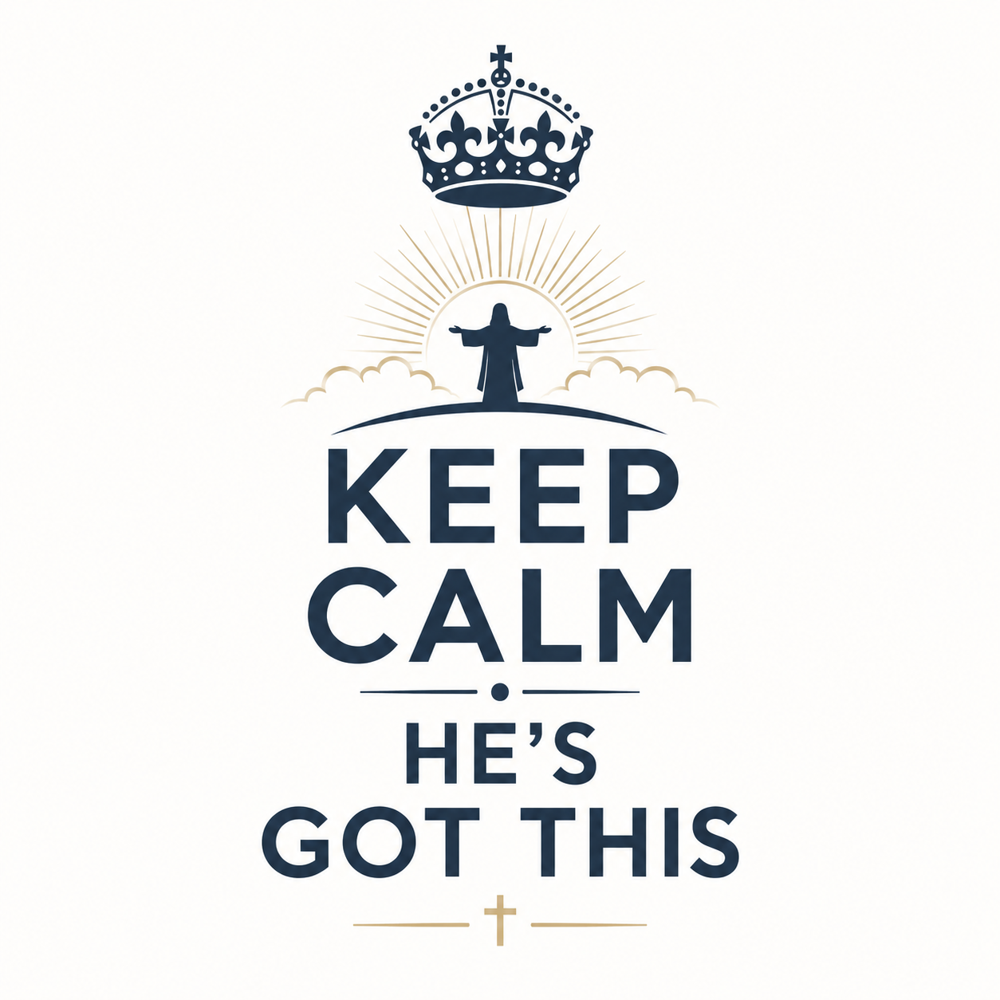

+++
title = "When You Can't Control the Storm"
slug = "when-you-cant-control-the-storm"
date = 2026-05-23 16:00:00
draft = false
tags = ['acts-27', 'trust', 'storms', 'sovereignty', 'obedience', 'faith', 'courage', 'lakepointe', 'sermon']
series = 'there-is-more-endgame'
+++

## Scripture References

* Acts 27
* 2 Corinthians 11
* Acts 21
* Acts 23
* John 19

## Introduction

* Guest speaker Jonathan "JP" Pokluda continues Lake Pointe's Acts series, "There Is More: Endgame," walking through Paul's harrowing voyage in Acts 27.
* From a prisoner's chains, Paul steadies 276 frightened people, proving that God -- not weather, not authorities -- holds the outcome.
* The chapter carries three big lessons: stay calm by remembering who is in charge, realize storms reveal real faith, and do your part while trusting God for everything else.

## Key Points / Exposition

### 1. Stay Calm by Remembering Who Controls the Outcome

* Paul, though in chains, warns the sailors that sailing after the Day of Atonement is disastrous; they ignore him.
* His peace rests in God's sovereignty: Paul cannot command weather or captains, but he can command his own obedience, speech, and attitude.
* Obedience is never measured by immediate results; it is measured by faithfulness to God's leading.
* Illustration: an eighth-grade flight that hit severe turbulence -- a Bible bouncing off the ceiling -- exposed a deeper fear: being out of control.
* Story: a bar confrontation where the aggressor calmly phoned two massive friends; his calm came from confidence in who backed him. Believers stay calm when they know who backs them.

### 2. The Storm Is Where Our Faith Is Seen

* Hurricane-force winds batter the ship for 14 days; cargo and tackle are thrown overboard, hope is lost.
* An angel assures Paul that he must stand before Caesar and all aboard will survive.
* Paul relays the message: "Keep up your courage...for I have faith in God that it will happen just as he told me."
* Storms give Christians their greatest platform; without trouble, faith remains theoretical.
* Historical note: John Wesley realized he was not truly saved after watching calm Moravian missionaries sing during a life-threatening storm.

### 3. Do Your Part and Trust God for the Rest

* Sailors try to abandon ship; Paul insists, "Unless these men stay with the ship, you cannot be saved." Soldiers cut the lifeboat away.
* For two weeks no one has eaten; Paul breaks bread, thanks God publicly, and everyone eats -- basic self-care restored.
* Practical takeaway: keep doing the basics (rest, Scripture, prayer, community) even when life feels chaotic.
* Illustration: a daughter "driving" the grocery-cart car -- Dad lets her turn the wheel but still directs the cart toward his unseen grocery list. Sometimes God lets us feel in control; other times He steers another way for a larger purpose.

## Major Lessons & Revelations

* God owns the outcome; our role is simple obedience.
* Storms do not create faith; they reveal the faith already present.
* Public courage in crisis can lead others to salvation and safety.
* Neglecting spiritual and physical basics during trials compounds the danger.
* God may calm the storm, or He may calm His child within the storm -- either way, He is faithful.

## Practical Application

* Surrender your need to manage every variable; practice immediate obedience in the small things.
* Speak up with reasoned, Spirit-led courage even if people ignore you.
* Maintain basic rhythms of Scripture, prayer, community, rest, and healthy habits when life gets turbulent.
* View current hardship as a platform to display authentic faith to onlookers.
* Rehearse God's past faithfulness to strengthen present trust.

## Conclusion & Call to Response

* The message closed with a sweeping reminder of God's proven experience -- parting seas, shutting lions' mouths, raising Jesus from the dead. If He has conquered death, He can certainly handle our storms.
* "If God is for you, who can be against you?"
* Whether He stills the wind or steadies your heart, He has you securely in His hands. Look at the birds, look at the flowers -- your Father cares far more for you.

## Prayer

* Father, calm Your people in their storms and thank You for Jesus' death and resurrection.
* Give us fresh vision of eternity so present problems shrink in comparison.
* Bless the church and its influence, and commit every listener to Your care in Jesus' name.

## References & Resources

* Lake Pointe sermon series: "There Is More: Endgame"
* Guest speaker: Jonathan "JP" Pokluda (Harris Creek Baptist Church)

## Insights

1. When life shakes like turbulence, remember the cockpit is occupied; God still holds the yoke.
2. Outcomes don't prove obedience; your courage to speak up does, so trust beyond the results.
3. Storms strip priorities fast, revealing what you worship; choose to anchor in eternal truth.
4. Faith isn't avoiding rough air; it's opening Scripture mid-drop and finding steady ground inside.
5. Your peace can pilot others; someone's survival may hinge on your choice to lead while chained.
6. If God can outrun death, He can outlast this downpour -- so stop fearing the forecast.

