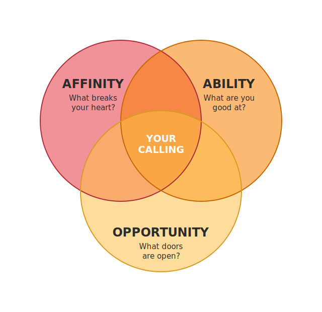

+++
title = "Ignited by God's Call: Discovering Your Divine Purpose"
slug = 'ignited-by-gods-call-discovering-your-divine-purpose'
date = 2026-07-04 16:00:00
draft = false
tags = ['en-fuego', 'sermon', 'lakepointe', 'calling', 'purpose', 'moses', 'exodus-3', 'burning-bush', 'i-am', 'obedience']
series = 'en-fuego'
+++

## Scripture References

* Exodus 3
* Exodus 2:23-25
* Ephesians 2:10
* 1 Corinthians 1:27

## Introduction

* Wrapping up the "En Fuego" series, the message goes to Exodus 3--the Bible's "Mount Everest" of fire passages--where God meets 80-year-old Moses in a flaming bush.
* Israel's 400 years of prayers move heaven; heaven moves Moses; Moses will move Pharaoh.
* Every Christian has a divine assignment, no matter age or past failures. Our call becomes clear at the intersection of what breaks our hearts (affinity), what we're gifted to do (ability), and the doors God opens (opportunity).
* Big idea: God ignites every believer with a specific calling; when affinity, ability, and opportunity meet, step out--because the great "I AM" is with you.

## Key Points / Exposition

### 1. You Have a Calling

* God planned "good works" for you before you were born (Ephesians 2:10)--we are His workmanship, created for pre-prepared good works.
* Israel's cries rose, and God remembered His covenant (Exodus 2:23-25)--the turning point of the narrative.
* Like Moses, you are God's answer to someone else's prayer; your obedience releases blessing.

### 2. Discover Your Calling: The Venn Diagram of Affinity, Ability, and Opportunity

* **Affinity -- What breaks your heart?**
  * Moses couldn't stand seeing an Egyptian beat a Hebrew.
  * Ask: "What can't I ignore? What gets me fired up for God's glory?"
* **Ability -- What are you (and what do others say you are) good at?**
  * Moses' 40 years in Pharaoh's court gave him executive-leadership skills.
  * Skills honed in the marketplace can be redirected for kingdom impact (examples: a CFO, a coach, an LAPD lieutenant now serving at church).
* **Opportunity -- What doors are open? Where is the greatest need?**
  * Moses alone had access to Pharaoh's palace.
  * Watch for open doors; the kingdom's needs, not personal comfort, drive the decision.
* When those three circles overlap, you've found the sweet spot of your calling.

### 3. Expect Insecurity, but Rely on "I AM"

* Moses' immediate reaction: "Who am I?" God's answer: "I will be with you."
* God often gives you more than you can handle so you depend on Him; He specializes in using the weak, foolish, and unlikely so His power, not ours, gets the glory (1 Corinthians 1:27).
* God reveals His name YHWH--"I AM"--signaling He is whatever His people lack. Throughout Scripture He adds modifiers (Rapha, Jireh, Ra'ah, etc.) to meet every need; Jesus applies "I AM" to Himself (bread, light, way, life).
* Stop disqualifying yourself; the question isn't your adequacy but His sufficiency.

## Major Lessons & Revelations

* Every believer has a divine assignment--age and past failures don't disqualify (Moses was 80).
* Life satisfaction flows from purpose, not compensation.
* Your calling sits where affinity, ability, and opportunity intersect.
* Your obedience is the delivery mechanism for someone else's answered prayer.
* Whatever the calling exposes as lacking in you, the name "I AM" supplies.

## Practical Application

* **Head** -- Understand that life satisfaction flows from purpose, not compensation. Map your own Venn diagram this week.
* **Heart** -- Replace "Who am I?" with worship of "I AM." Let His sufficiency silence your insecurity.
* **Hands**
  * List what breaks your heart, where you're gifted, and doors now open; look for the overlap.
  * Ask two trusted people to name your strengths--confirming your "ability" circle.
  * Take one concrete step: join a ministry team, shift to a Saturday-night service to make room for guests, or begin the training that fits your calling.

## Reflection Questions

1. What situation or injustice do you find impossible to ignore--and why might that signal your calling?
2. Which abilities or experiences could God repurpose for His kingdom?
3. What open doors or pressing needs lie in front of you right now?
4. When you sense God's call, what insecurities surface most quickly?
5. How does knowing God's name "I AM" encourage you to move forward this week?

## Conclusion & Call to Response

* Identify and step into the God-given assignment that meets your affinity, ability, and opportunity, trusting the "I AM" to supply what you lack.
* Stop asking "Who am I?" and start obeying "I AM sends me."

## Prayer

> Father, thank You for hearing the cries of people and sending servants like Moses--and like us. Help us discern the place where our passion, gifting, and opportunity meet. When we feel inadequate, remind us that You are the great "I AM," more than enough for every lack. Ignite our hearts with holy fire, rearrange our priorities, and send us to be the answer to someone's prayer, all for Jesus' glory. Amen.

## Insights

1. Stop waiting for perfect timing; God is never late, just strategic.
2. If your age starts with a 7, so what? Your purpose hasn't retired.
3. What you can't stand seeing might be God saying, "Go fix that."
4. Your calling lives where passion meets skill and an open door; find that holy collision zone.
5. Fire from God isn't goosebumps; it's priorities burned into new order.
6. You are somebody else's miracle in motion; stop spectating and answer their prayer.
7. God loves using underdogs because nobody claps for them, everyone claps for His unstoppable grace.
